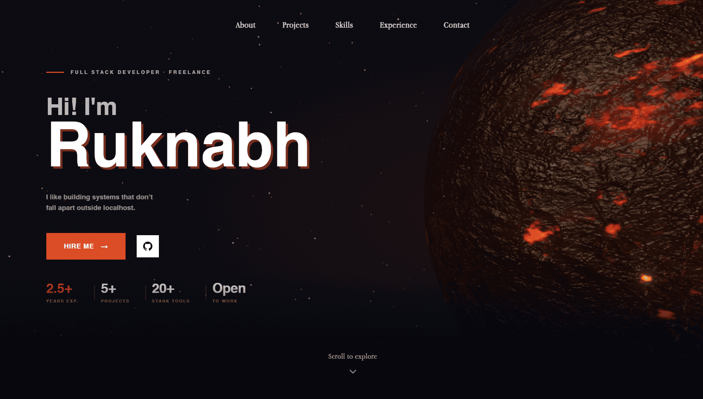

# Portfolio — Ruknabh Bhattacharyya

Personal portfolio site. Built with Next.js, TypeScript, and a brutalist editorial aesthetic.

Live: [ruknabh-portfolio.vercel.app](https://ruknabh-portfolio.vercel.app)



---

## Stack

**Framework** — Next.js 15 (App Router), TypeScript  
**Styling** — Tailwind CSS, custom CSS variables  
**Animation** — Framer Motion (scroll-driven + entrance animations)  
**3D** — Three.js, React Three Fiber, Drei, postprocessing (Bloom)  
**Icons** — Lucide React  
**Deployment** — Vercel

---

## Structure

```
app/
  page.tsx                      # Root — assembles all sections
components/
  Navigation.tsx                # Sticky nav; hamburger menu on mobile
  Planetmodel.tsx               # Three.js lava planet GLB with Bloom post-processing
  Footer.tsx
  sections/
    Hero.tsx                    # Full-screen hero with animated name, 3D planet, starfield
    About.tsx                   # Profile card + bio, scroll-linked entrance
    Projects.tsx                # Project cards with scroll-rise panel animation
    Skills.tsx                  # Scroll-driven marquee rows (Frontend / Backend / Tooling)
    Experience.tsx              # Work cards with certificate lightbox
    Contact.tsx                 # Contact form + socials + resume download
  ui/
    button.tsx
    card.tsx
public/
  models/                       # lava_planet_optimized.glb
  images/                       # Profile photo, project screenshots, certificates
  icons/                        # SVG tech icons
  resume.pdf
```

---

## Notable implementation details

**3D Planet** — GLB model rendered via React Three Fiber with custom directional + point lighting and Bloom post-processing. Mobile gets reduced DPR (0.75), fewer lights, and lower Bloom intensity to keep GPU usage reasonable.

**Hero starfield** — Canvas-based particle system. 240 stars on desktop, 120 on mobile. Each star tweens opacity and drifts slowly.

**Scroll animations** — Framer Motion's `useScroll` + `useTransform` drive most entrance animations. The Projects section uses a scroll-rise panel effect (`scale`, `borderRadius`, `width` all tied to scroll progress).

**Skills marquee** — Three rows scroll in opposite directions, driven directly by page scroll position rather than a CSS animation loop. No autoplay, no JS interval.

**Mobile planet** — Separate DOM slot from the desktop version. Rendered at 145vw, shifted to the lower-right, with a softer radial mask so it doesn't compete with the text.

---

## Running locally

```bash
npm install
npm run dev
```

Requires Node 18+. No environment variables needed.

---

## License

Code is open for reference. Do not copy the content (bio, images, certificates).